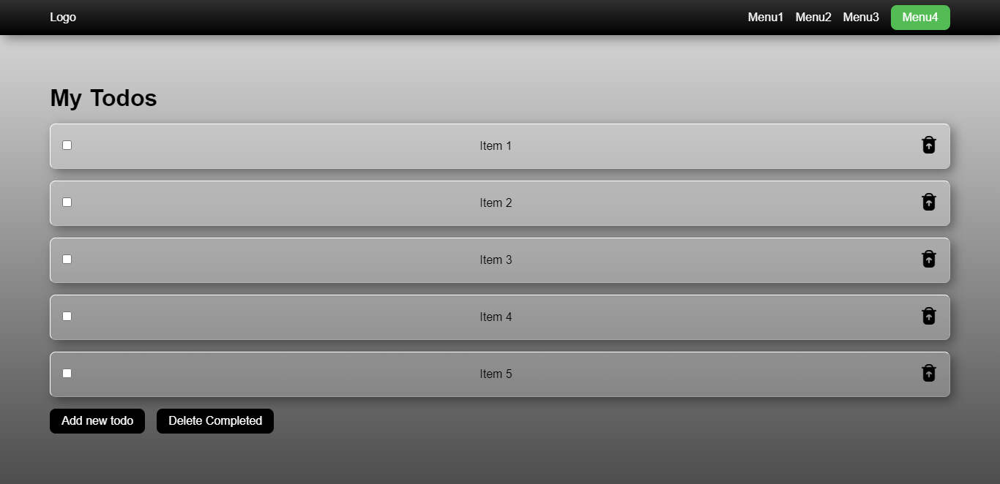

 

# Todo List

This is a simple Rails todo list application that I created to practice the basics of Rails and CRUD operations. The application allows users to create, read, update, and delete tasks.

Features:

- Users can create new tasks with a description
- Tasks can be marked as complete or incomplete
- Users can view a list of all tasks, including completed and incomplete tasks
- Users can edit or delete existing tasks

Technologies used:

Ruby on Rails
ActiveRecord
PostgreSQL database
This project was a great opportunity for me to get hands-on experience with the basics of Rails development, including routing, views, and controllers.

Feel free to clone the repository and try the application out for yourself!

# Quick view

# Live Demo Version

...loading

## Getting Started

- Check the Ruby version or if you have at all by running `ruby -v` if you get something like this `ruby 2.6.8p205 (2021-07-07 revision 67951)` you have Ruby installed.
- Clone the repository by running `git clone https://github.com/VitorGuedesMadeira/Rails-Todo.git` in your CLI.
- Type `cd Rails-Todo`
- Type `code .`
- Run `bundle install`
- Run `rails db:create db:migrate` to create and set database
- Run `rails server` to open the local server
- Open Browser `http://localhost:3000/`

## Author

👤 **Vitor Guedes Madeira** 🧑🏻‍💻
- GitHub: [@githubhandle](https://github.com/VitorGuedesMadeira)
- Medium: [@vitorguedesmadeira](https://medium.com/@vitorguedesmadeira)
- LinkedIn: [Vitor Guedes](https://www.linkedin.com/in/vitor-guedes-madeira/)

## 🤝 Contributing

Contributions, issues, and feature requests are welcome!
Feel free to check the [issues page](https://github.com/VitorGuedesMadeira/Rails-Todo/issues).

## Show your support

Give a ⭐️ if you like this project!

## 📝 License

This project is [MIT](./MIT.md) licensed.
